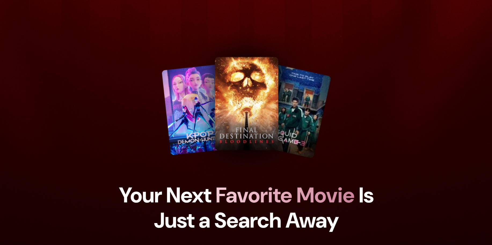
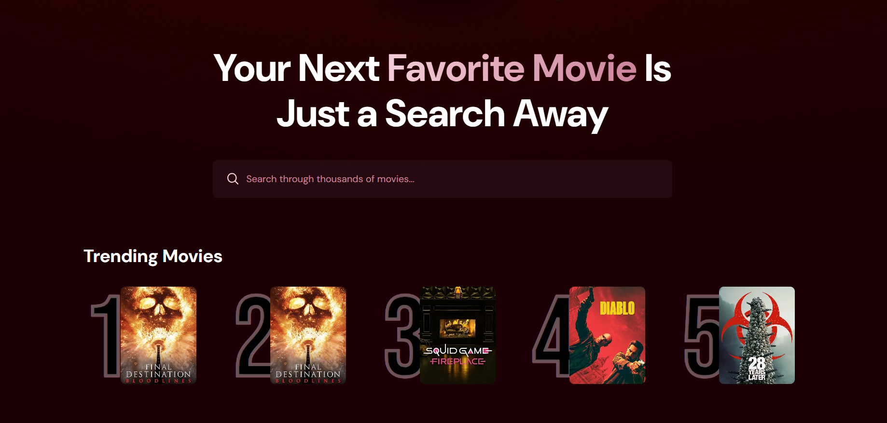
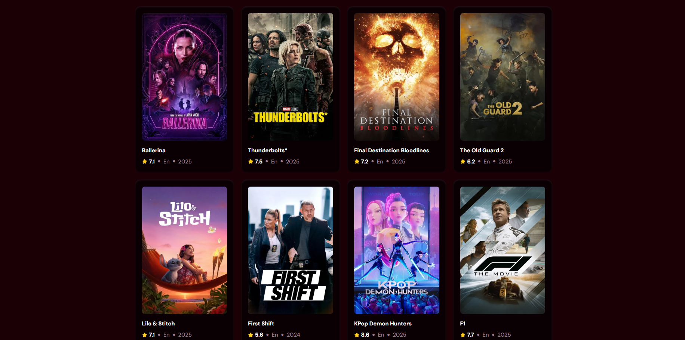

# 🎬 movieSea - Smart Movie Discovery Without the Hassle
<div align="center">
  <a href="https://movie-sea-omega.vercel.app/" target="_blank">
    
  </a>
  <br />
  
  
  
  
  
  
</div>

## 🤖 Introduction

**movieSea** is a smart and responsive movie recommendation web app built with React, Firebase, and TailwindCSS. It allows users to search for movies using the TMDB API, and also tracks movie popularity using Firestore to surface top trending titles.





## 🚀 Live Demo

[👉 View Live](https://movie-sea-omega.vercel.app/)

## Features

- 🔍 Debounced movie search (no redundant API calls)
- 📊 Popularity tracking with Firestore (auto-increment count)
- 🔝 Fetch and display top 5 trending movies
- 🎬 Movie card UI with poster, title, language, year, rating

## 🤸 Getting Started

### 1️⃣ Clone the Repository

```bash
git clone https://github.com/idevRavn/movieSea.git
cd movieSea
npm install
```

### 2️⃣ Setup Environment Variables
Create a `.env.local` file in the root:

```bash
VITE_TMBD_API_KEY=
VITE_FIREBASE_API_KEY=
VITE_FIREBASE_AUTH_DOMAIN=
VITE_FIREBASE_PROJECT_ID=
VITE_FIREBASE_STORAGE_BUCKET=
VITE_FIREBASE_MESSAGING_SENDER_ID=
VITE_FIREBASE_APP_ID=
VITE_FIREBASE_MEASUREMENT_ID=
```

### 3️⃣ Development Mode

```bash
npm run dev
```

📌 Open **http://localhost:5173** in your browser to view the site.

## 🛠️ Tech Stack

- React.js
- Vite
- Firebase Firestore Database
- Tailwind CSS
- TMDB API
- Vercel

## 🤝 Contributing

Contributions are welcome! If you have ideas for improvement or want to add features, please fork the repository and submit a pull request.